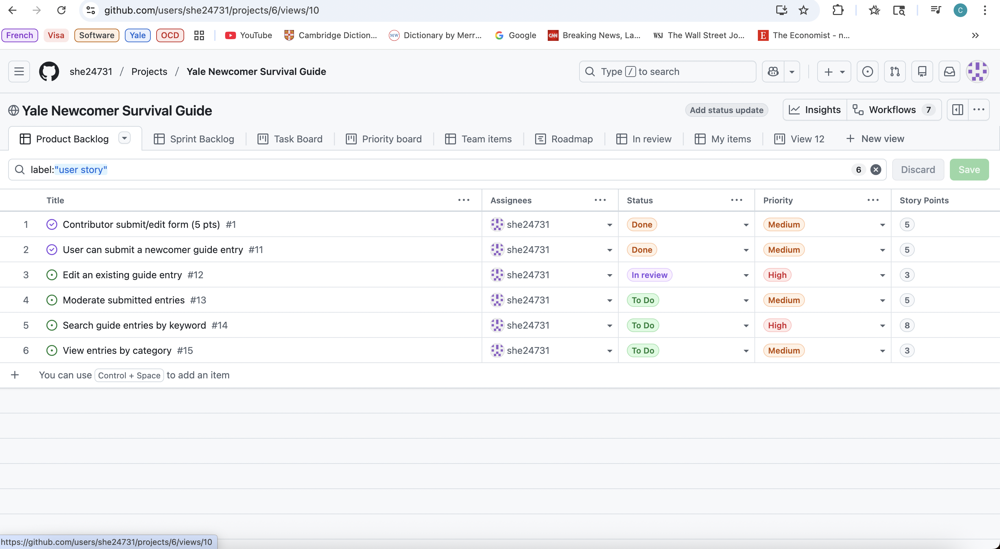
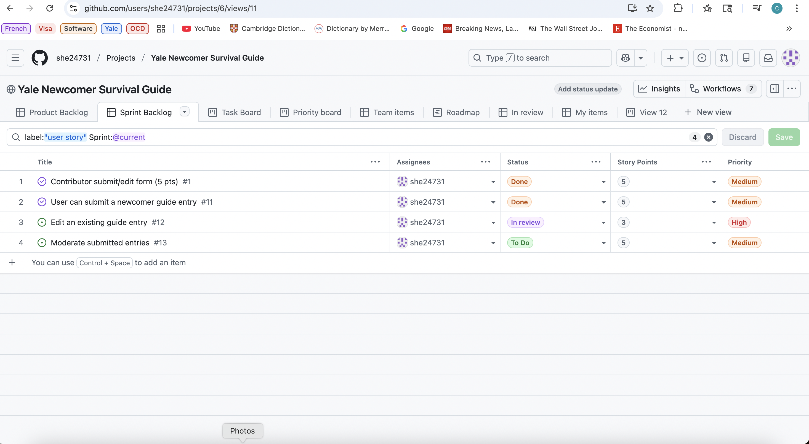
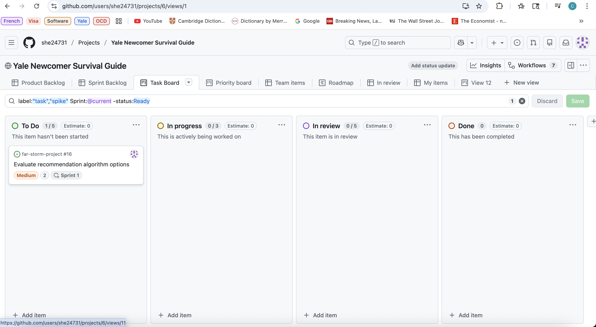

# Yale Newcomer Survival Guide

A community-driven web application helping Yale newcomers navigate life in New Haven. Contributors share knowledge through categorized posts about housing, food, transportation, academics, and more, while administrators moderate content to ensure quality.

**Team:** far-storm  
**Course:** MGT656 - Management of Software Development  
**Team Members:** stormy-deer (Chun-Hung Yeh), adorable-crow (Celine Li), super-giraffe (Denise Wu)

---

## 1. Problem Statement

New students and staff arriving at Yale face numerous challenges when transitioning to life in New Haven: finding suitable housing, discovering local restaurants and dining options, understanding public transportation systems, navigating academic resources, and identifying essential services. Existing information sources are scattered across multiple platforms (Facebook groups, university websites, word-of-mouth), making it difficult for newcomers to find reliable, up-to-date, and contextually relevant information in one place.

This application addresses this problem by providing a centralized, community-driven platform where experienced Yale community members can share knowledge through categorized posts, while newcomers can easily discover essential information. The platform implements a contributor-admin moderation workflow to ensure content quality while maintaining community engagement.

**Target Users:**
- **Newcomers:** Students, staff, and faculty new to Yale who need practical, actionable information
- **Contributors:** Existing community members who want to share knowledge and recommendations
- **Admins:** Content moderators responsible for reviewing and approving posts to maintain quality standards

---

## 2. MVP Scope

### Included Functionality

The MVP delivers a functional web application with the following scope:

- **User Authentication:** Registration and login with role-based access control (Reader, Contributor, Admin)
- **Content Creation:** Contributors can create and submit posts with categories, titles, and content
- **Content Moderation:** Three-stage workflow (draft → pending → approved/rejected) with admin review
- **Content Discovery:** Public browsing of approved posts organized by categories with search functionality
- **User Management:** Contributor dashboard for managing own posts, admin dashboard for moderation
- **A/B Testing Infrastructure:** Analytics endpoint for experimentation with button label variants

### Excluded Functionality

The following features are intentionally excluded from the MVP scope:

- Advanced search with filters or faceted search
- User profiles or user-generated content beyond posts
- Commenting or discussion threads on posts
- Email notifications or subscription features
- Mobile application (web-only, responsive design)
- Payment or marketplace functionality
- Real-time chat or messaging

---

## 3. Core Features

### Feature 1: User Authentication & Role Management
Django's built-in authentication system extended with role-based access control using user groups. New users automatically receive the "Reader" role upon registration. Three roles are supported: Reader (browse approved content), Contributor (create and manage posts), and Admin (moderate content). Session-based authentication with secure password handling.

### Feature 2: Content Creation & Moderation Workflow
Contributors can create posts with titles, content, and category assignments. Posts follow a three-stage workflow: Draft (editable by author) → Pending Review (awaiting admin approval) → Approved/Rejected (published or declined). Auto-generated unique slugs from titles. Approved posts automatically receive `published_at` timestamps and become publicly visible.

### Feature 3: Category-Based Organization & Discovery
Posts are organized into categories (Housing, Food, Transport, Academics, etc.) for intuitive navigation. Category listing pages with pagination. Public search functionality across post titles and content. Only approved posts are visible to non-authenticated users.

### Feature 4: Contributor & Admin Dashboards
Contributors have access to a personal dashboard (`/my-posts/`) showing all their posts with status indicators. Contributors can edit draft/rejected posts and delete their own posts. Admins have a moderation dashboard (`/dashboard/`) displaying all pending posts with approve/reject actions.

### Feature 5: A/B Testing & Analytics Infrastructure
Publicly accessible A/B test endpoint at `/218b7ae/` (derived from first 7 characters of SHA1("far-storm")). Tests button label variants ("kudos" vs "thanks") with 50/50 random split persisted via session cookies. Server-side event tracking via `ABTestEvent` model records exposures and conversions. Google Analytics 4 integration provides real-time monitoring.

---

## 4. Tech Stack

### Backend
- **Framework:** Django 4.2.26
- **Database:** PostgreSQL (production via Render) / SQLite (local development)
- **Database Management:** Django ORM with migrations
- **Authentication:** Django's built-in session-based authentication

### Frontend
- **UI Framework:** Bootstrap 5 for responsive design
- **Templating:** Django templates with template inheritance
- **JavaScript:** Minimal client-side scripting for A/B test interactions and GA4 event tracking

### Infrastructure & Deployment
- **Hosting Platform:** Render (staging and production environments)
- **Static Files:** WhiteNoise middleware for production static file serving
- **Process Manager:** Gunicorn WSGI server
- **Configuration Management:** Environment variables with `python-decouple` for local .env support

### Analytics & Monitoring
- **Client-Side Analytics:** Google Analytics 4 (GA4) with measurement ID `G-9XJWT2P5LE`
- **Server-Side Tracking:** Django `ABTestEvent` model for reliable event storage
- **Logging:** Django logging configured to write to stdout (12-factor compliant)

### Development Tools
- **Version Control:** Git with GitHub
- **Linting:** Ruff 0.7.0 (configured in `pyproject.toml`)
- **Testing:** Django Test Framework
- **Continuous Integration:** GitHub Actions

---

## 5. Authentication Approach

The application uses Django's built-in authentication system with the following implementation:

**User Registration:**
- Custom `UserRegistrationForm` extends Django's `UserCreationForm`
- New users are automatically assigned to the "Reader" group upon registration
- Users are automatically logged in after successful registration
- Registration accessible at `/signup/`

**Login/Logout:**
- Custom login view extends Django's `LoginView` with role-based redirects
- Login accessible at `/login/`
- Logout uses Django's `LogoutView` with success messages
- Session-based authentication stores user session data in database

**Role-Based Access Control:**
- Three user groups: "Reader", "Contributor", "Admin"
- Permissions enforced via decorators: `@login_required` and `@user_passes_test`
- Contributor submission pages (`/submit/`) require `is_contributor()` check
- Admin dashboard (`/dashboard/`) requires `is_staff` flag or `is_admin()` check
- Public content (approved posts) accessible without authentication

**Session Management:**
- Django sessions stored in database (configured via `SESSION_ENGINE`)
- Session cookies used for authentication persistence
- Session data also used for A/B test variant assignment and deduplication

---

## 6. Database Models Overview

The application uses the following Django models:

### Category
Organizes posts by topic (Housing, Food, Transport, Academics, etc.). Fields: `name` (unique), `slug` (unique, indexed), `description`, `created_at`. One-to-many relationship with Post model.

### Post
Stores user-generated content with moderation workflow. Fields: `title`, `slug` (unique, auto-generated), `content`, `category` (ForeignKey), `author` (ForeignKey to User), `status` (draft/pending/approved/rejected), `updated_at`, `published_at` (auto-set on approval). Indexes on `status`, `category_id`, and `updated_at` for query performance.

### Bookmark
Allows authenticated users to save posts for later reference. Fields: `user` (ForeignKey), `post` (ForeignKey), `created_at`. Unique constraint on `(user, post)` prevents duplicates.

### ExternalLink
Stores curated external resources related to categories. Fields: `title`, `url`, `category` (ForeignKey, optional), `created_at`, `updated_at`.

### ABTestEvent
Server-side tracking of A/B test exposures and conversions. Fields: `experiment_name`, `variant`, `event_type` (exposure/conversion), `endpoint`, `session_id`, `ip_address`, `user_agent`, `user` (ForeignKey, optional), `created_at`. Composite indexes on `(experiment_name, variant, event_type)` and `(experiment_name, created_at)` for efficient querying. Used for analytics analysis via management command `abtest_report`.

All models use Django migrations for schema management, ensuring version-controlled and reproducible database changes across environments.

---

## 7. Deployment URLs

### Staging Environment
**URL:** https://yale-newcomer-survival-guide-staging.onrender.com/

Staging environment used for testing changes before production deployment. Same codebase as production with separate PostgreSQL database instance. Used for QA testing, integration verification, and safe experimentation with new features.

### Production Environment
**URL:** https://yale-newcomer-survival-guide.onrender.com/

Production environment serving live users. Stable, tested code only. Production PostgreSQL database. Monitored for performance and errors via Render's logging infrastructure.

Environment separation enables safe testing of database migrations, configuration changes, and new features without impacting production users.

### A/B Test Endpoint
**URL:** https://yale-newcomer-survival-guide.onrender.com/218b7ae/

Publicly accessible A/B test endpoint. No authentication required. Displays team information and button with variants for experimentation.

---

## 8. CI/CD Pipeline

### Continuous Integration (GitHub Actions)

Automated CI pipeline implemented via `.github/workflows/ci.yml` that runs on:
- Push events to `main` branch
- Pull request events targeting `main` branch

**Pipeline Steps:**
1. **Checkout:** Retrieve code from GitHub repository
2. **Python Setup:** Configure Python 3.9 environment
3. **Dependencies:** Install all packages from `requirements.txt` with pinned versions
4. **Linting:** Run `ruff check .` to enforce code quality standards
5. **Testing:** Execute `python manage.py test` using SQLite database

**CI Configuration:**
- Uses test-safe environment variables (`DEBUG=1`, dummy `SECRET_KEY`)
- SQLite database for fast, reliable test execution without external dependencies
- Prevents broken code from being merged to main branch
- Catches linting errors and test failures before code integration

### Continuous Deployment (Render)

Render automatically deploys from GitHub on commits to `main` branch:

**Build Process:**
- Installs dependencies from `requirements.txt`
- Runs `python manage.py collectstatic --noinput` to prepare static files for WhiteNoise
- Runs `python manage.py migrate` to apply database migrations

**Start Process:**
- Launches Gunicorn WSGI server: `gunicorn config.wsgi:application --bind 0.0.0.0:$PORT`
- Binds to port provided by Render via `$PORT` environment variable
- Health checks configured to ensure service availability

**Configuration:**
- Environment variables configured via Render dashboard
- PostgreSQL database automatically provides `DATABASE_URL`
- `RENDER_EXTERNAL_HOSTNAME` automatically set by Render

This CI/CD approach maintains code quality and enables rapid, reliable deployments.

---

## 9. 12-Factor App Compliance Summary

The application explicitly follows all 12-factor app methodology principles:

**I. Codebase:** Single Git repository deployed to multiple environments (local, staging, production) without divergence.

**II. Dependencies:** Explicitly declared in `requirements.txt` with pinned versions (e.g., `Django==4.2.26`, `ruff==0.7.0`). No system-level dependencies assumed.

**III. Config:** All configuration stored in environment variables (`SECRET_KEY`, `DATABASE_URL`, `DEBUG`, `ALLOWED_HOSTS`, `GA_MEASUREMENT_ID`). No hardcoded secrets or environment-specific values in code. Local development uses `python-decouple` for `.env` file support, but production requires explicit environment variables.

**IV. Backing Services:** Database (PostgreSQL/SQLite) treated as attached resource via `DATABASE_URL` environment variable, using `dj-database-url` for connection management. Database connection treated as interchangeable resource.

**V. Build, Release, Run:** Strict separation via Render's build and start commands. Build installs dependencies and runs migrations. Release is managed by Render. Run executes via Gunicorn start command.

**VI. Processes:** Stateless application processes with no shared memory or filesystem state. Session data stored in database, static files served via WhiteNoise.

**VII. Port Binding:** Application binds to port provided by `$PORT` environment variable (Render automatically sets this). No hardcoded ports.

**VIII. Concurrency:** Stateless process model supports horizontal scaling. Multiple Gunicorn workers can run simultaneously.

**IX. Disposability:** Fast startup (Django initialization completes quickly), graceful shutdown (Gunicorn handles SIGTERM), minimal startup overhead.

**X. Dev/Prod Parity:** Same codebase across all environments. Differences handled via environment variables (DEBUG, DATABASE_URL). Same Python version, same dependencies.

**XI. Logs:** All logging configured to write to stdout via Django `LOGGING` configuration with `StreamHandler`. Render captures stdout as log streams. Logging level configurable via `DJANGO_LOG_LEVEL` environment variable.

**XII. Admin Processes:** Management commands (`python manage.py migrate`, `python manage.py abtest_report`) run as one-off processes, not as long-running services.

**Verification:** `config/settings.py` explicitly loads all configuration from environment variables. `.gitignore` excludes `.env` files. No secrets are committed to the repository. Logging configuration writes to `StreamHandler` (stdout).

---

## 10. Testing Strategy

### Test Coverage

The codebase includes comprehensive automated tests using Django's test framework:

**Test Suite:**
- **Total Test Files:** 12 test files in `core/tests/`
- **Coverage:** >75% overall, 100% on critical models
- **Test Types:** Unit tests, integration tests, view tests, model tests

**Test Files:**
- `test_abtest.py`: A/B test endpoint and variant assignment
- `test_abtest_session_dedupe.py`: Session-based deduplication logic
- `test_abtest_report_command.py`: Management command functionality
- `test_url_routing.py`: URL resolution and routing correctness
- `test_post_model.py`: Post model functionality and workflow
- `test_category_model.py`: Category model functionality
- `test_bookmark_model.py`: Bookmark functionality
- `test_external_link.py`: ExternalLink model
- `test_integration.py`: End-to-end user workflows
- Additional tests for forms, admin, and views

### Test Execution

**Local Testing:**
```bash
python manage.py test
```

**CI Testing:**
- Automated test execution via GitHub Actions on every push and pull request
- SQLite database for fast, reliable test execution
- All tests must pass before code can be merged

**Test Categories:**
- **Unit Tests:** Individual model methods, form validation, helper functions
- **Integration Tests:** Complete user workflows (registration → post creation → moderation → publication)
- **View Tests:** HTTP request/response handling, authentication, authorization
- **Model Tests:** Database operations, relationships, constraints

**Limitations:**
- No browser-based end-to-end tests (Selenium/Playwright)
- Limited performance testing (query optimization tested manually)
- No load testing for production capacity planning

---

## 11. Analytics Endpoint

### A/B Test Endpoint

**URL:** `/218b7ae/` (publicly accessible, no authentication required)

The A/B test endpoint serves as both an analytics endpoint and experimentation platform:

**Endpoint Features:**
- Displays team nickname "far-storm" and all team members
- Shows button with `id="abtest"` displaying either "kudos" or "thanks" variant
- 50/50 random variant assignment persisted via Django session cookie
- Variant consistency maintained across page reloads within same session

**Analytics Tracking:**

**Server-Side (Primary Source of Truth):**
- `ABTestEvent` model records all events in PostgreSQL database
- Exposure events: Logged once per session on first page load (deduplicated)
- Conversion events: Logged on each button click
- Session-based deduplication prevents double-counting exposures
- Bot filtering excludes non-human traffic (User-Agent, headers, request method)
- Database indexes optimize query performance for analytics analysis

**Client-Side (Real-Time Monitoring):**
- Google Analytics 4 (GA4) events provide real-time visibility
- `ab_exposure` event fired once per session on first exposure
- `ab_button_click` event fired on each button click
- GA4 measurement ID: `G-9XJWT2P5LE`
- Context processor injects GA4 configuration into all templates

**Analytics Analysis:**
- Management command `python manage.py abtest_report` analyzes `ABTestEvent` data
- Calculates exposures, conversions, and conversion rates per variant
- Identifies winning variant based on higher conversion rate
- Provides statistical warnings for insufficient sample sizes

**Click Endpoint:**
- **URL:** `/218b7ae/click/` (POST-only endpoint)
- Handles button click events
- Logs conversion events server-side
- Returns JSON response with variant information
- Backfills exposure if missing (ensures exposure before conversion)

---

## 12. A/B Testing Logic

### Experiment Design

**Experiment Name:** `button_label_kudos_vs_thanks`

**Endpoint:** `/218b7ae/` (derived from first 7 characters of SHA1("far-storm"))

**How to Compute the Endpoint Hash:**

The endpoint `/218b7ae/` is derived from the first 7 characters of the SHA1 hash of the team nickname "far-storm".

**Python:**
```python
import hashlib
hash_value = hashlib.sha1("far-storm".encode()).hexdigest()[:7]
print(hash_value)  # Output: 218b7ae
```

**Command Line (macOS/Linux):**
```bash
echo -n "far-storm" | shasum -a 1 | cut -c1-7
# Output: 218b7ae
```

**Access the Endpoint:**
- Production: https://yale-newcomer-survival-guide.onrender.com/218b7ae/
- Local Development: http://127.0.0.1:8000/218b7ae/

**Variants:** Two button label variants tested:
- **"kudos"**: Button displays text "kudos"
- **"thanks"**: Button displays text "thanks"

**Split Ratio:** 50/50 random assignment

**Assignment Logic:**
- Variant assigned once per session using random selection
- Assignment persisted via Django session cookie (`abexp:button_label_kudos_vs_thanks:variant`)
- Same variant shown to user across all page reloads within same session
- Variant consistency ensures valid A/B test comparison

### Event Tracking Logic

**Exposure Events:**
- Logged when user first visits `/218b7ae/` in a session
- Only logged for real browser navigations (bot filtering applied)
- Session-based deduplication: Session flag `abexp:button_label_kudos_vs_thanks:exposed:/218b7ae/` prevents duplicate logging
- Database-level deduplication: Uniqueness constraint on `(experiment_name, event_type="exposure", endpoint, session_id)` ensures atomicity
- Bot filtering: User-Agent checking, header analysis (`Sec-Fetch-Mode: navigate`), request method validation (GET only)

**Conversion Events:**
- Logged when user clicks button with `id="abtest"`
- Multiple conversions allowed per session (users can click multiple times)
- Variant taken from session only (not from POST body) to prevent manipulation
- Exposure backfilling: If conversion occurs without prior exposure logged, exposure is backfilled once

### Deduplication Strategy

**Session-Level:**
- Session flags checked before logging exposure
- Prevents double-counting from page refreshes or browser back/forward navigation
- Flags stored in Django session (database-backed)

**Database-Level:**
- `ABTestEvent.objects.get_or_create()` with uniqueness constraints ensures atomicity
- Prevents race conditions in concurrent requests
- Database indexes optimize uniqueness checks

### Cache Control

**Implementation:**
- `@never_cache` decorator on both A/B test views
- Explicit cache headers: `Cache-Control: no-store, no-cache, must-revalidate, max-age=0`
- `Vary: Cookie` header ensures responses vary by session
- Prevents browsers and CDNs from caching variant assignments

**Rationale:**
- Ensures each user session receives fresh variant assignment
- Prevents cached responses from skewing A/B test results
- Maintains variant consistency within session while preventing cross-session caching

### Analysis Methodology

**Data Source:**
- Primary: Server-side `ABTestEvent` database records (reliable, bot-filtered)
- Secondary: Google Analytics 4 real-time dashboard (validation, monitoring)

**Metrics:**
- Exposures: Count of unique sessions seeing each variant
- Conversions: Count of button clicks per variant
- Conversion Rate: (Conversions / Exposures) × 100%

**Statistical Considerations:**
- Sample size requirements: ≥30 exposures per variant for basic analysis, ideally ≥100 for statistical significance
- Bot traffic filtered to ensure data quality
- Session-based deduplication ensures accurate exposure counts
- Management command provides warnings for insufficient sample sizes

---

## 13. Team Members & Contributions

### Team: far-storm

### stormy-deer (Chun-Hung Yeh)

**Primary Contributions:**
- **Backend Architecture:** Django project setup and configuration, application structure
- **A/B Testing Implementation:** `/218b7ae/` endpoint, `ABTestEvent` model, variant assignment logic, session-based deduplication
- **Analytics Integration:** Google Analytics 4 context processor, server-side and client-side event tracking
- **Deployment & Infrastructure:** Render configuration, PostgreSQL setup, environment variable management, build/start commands
- **DevOps & CI/CD:** GitHub Actions workflow configuration, automated testing and linting
- **12-Factor Compliance:** Environment variable configuration, logging to stdout, static files configuration
- **Testing:** Comprehensive test suite development, coverage tooling configuration
- **Management Commands:** `abtest_report` command for analytics analysis

### adorable-crow (Celine Li)

**Primary Contributions:**
- **Frontend Development:** Template architecture, Bootstrap 5 integration, responsive UI design
- **User Authentication:** Registration and login views, user group assignment logic, role-based access control implementation
- **Contributor Features:** Post submission forms, contributor dashboard (`/my-posts/`), post editing functionality
- **User Experience:** UI/UX design, form validation, error handling, user feedback messages
- **Testing & QA:** A/B test endpoint testing, analytics verification, user workflow testing
- **Code Reviews:** Quality assurance and code review contributions

### super-giraffe (Denise Wu)

**Primary Contributions:**
- **Database Design:** Category, Post, Bookmark, ExternalLink, and ABTestEvent model design and implementation
- **Admin Tools:** Admin moderation dashboard (`/dashboard/`), approve/reject workflow implementation
- **Content Management:** Category organization, post workflow logic, status transition handling
- **Backend Views:** URL routing, view implementation, access control logic
- **A/B Testing Planning:** A/B testing infrastructure planning and design
- **Testing & QA:** Production deployment testing, integration testing, database schema validation
- **Documentation:** Sprint documentation and process improvement documentation

### Shared Responsibilities

Per course policy, all team members share equal responsibility for project outcomes and grading. While individual contributions are listed above, the project represents a collaborative effort with:
- Code reviews across all features
- Pair programming on complex functionality
- Shared decision-making throughout all four sprints
- Collective responsibility for final submission quality

**GitHub Repository:** [Repository URL]

---

## Local Setup

### Prerequisites

- Python 3.9+
- pip
- virtualenv (or venv)

### Installation Steps

1. **Clone the repository**
   ```bash
   git clone [repository-url]
   cd yale-newcomer-survival-guide
   ```

2. **Create virtual environment**
   ```bash
   python3 -m venv venv
   source venv/bin/activate  # On Windows: venv\Scripts\activate
   ```

3. **Install dependencies**
   ```bash
   pip install -r requirements.txt
   ```

4. **Configure environment variables**
   
   Create a `.env` file in the project root:
   ```bash
   DJANGO_SECRET_KEY=your-secret-key-here
   DEBUG=True
   DJANGO_ALLOWED_HOSTS=127.0.0.1,localhost
   DATABASE_URL=sqlite:///db.sqlite3
   GA_MEASUREMENT_ID=G-9XJWT2P5LE
   ```

5. **Run migrations**
   ```bash
   python manage.py migrate
   ```

6. **Create superuser (optional)**
   ```bash
   python manage.py createsuperuser
   ```

7. **Run development server**
   ```bash
   python manage.py runserver
   ```

8. **Access the application**
   - Application: http://127.0.0.1:8000
   - Admin interface: http://127.0.0.1:8000/admin/
   - A/B test endpoint: http://127.0.0.1:8000/218b7ae/

---

## Screenshots

### Project Board Views

The project uses GitHub Projects for Agile project management. The following screenshots demonstrate different views of the project board:

**Product Backlog View:**

Shows the filtered Product Backlog view with user stories, their status, priority, and story points. Demonstrates the backlog organization with filter `label:"user story"` applied.

**Sprint Backlog View:**

Shows the Sprint Backlog view filtered to show current sprint items (`Sprint:@current`) with user story label. Displays tasks in their current status (Done, In review, To Do) with assignees and priorities.

**Task Board View (Kanban):**

Shows the Kanban-style Task Board view with columns for "To Do", "In progress", "In review", and "Done". Demonstrates the workflow visualization and task status tracking for the current sprint.

---

## Additional Resources

- **Sprint Documentation:** `/docs/sprints/` (planning, review, retrospective for all 4 sprints)
- **Final Report:** `/docs/final-report.md` (comprehensive project documentation)
- **Velocity Chart:** `/docs/velocity.png` (generated via `scripts/velocity_chart.py`)
- **A/B Test Analysis:** Run `python manage.py abtest_report`

---

**Built by Team far-storm (stormy-deer, adorable-crow, super-giraffe) for MGT656 - Management of Software Development**
