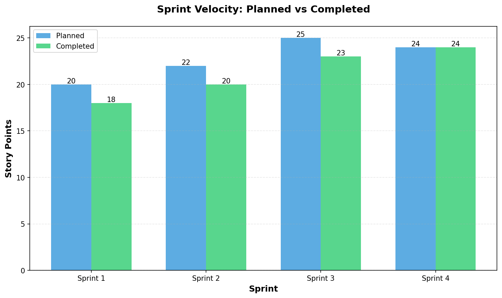

# Final Project Report

## Yale Newcomer Survival Guide - Team far-storm

**Team Members:** stormy-deer (Chun-Hung Yeh), adorable-crow (Celine Li), super-giraffe (Denise Wu)  
**Project Duration:** 4 Sprints  
**Final Submission Date:** [TBD: date]

---

## 1. Comprehensive Burndown/Velocity Chart

### Velocity Calculation Methodology

We tracked sprint velocity by comparing planned story points against completed story points for each sprint. Story points were estimated using a modified Fibonacci scale (1, 2, 3, 5, 8, 13), and completion was measured against our Definition of Done criteria:

- Code reviewed by at least one team member
- All tests passing (`python manage.py test`)
- Ruff linting passes (`ruff check .`)
- No critical bugs
- Documentation updated
- Changes merged to main branch

Velocity represents the number of story points completed in each sprint, while completion rate is calculated as (Completed Points / Planned Points) × 100%.

### Sprint Velocity Data

| Sprint | Planned Points | Completed Points | Velocity | Completion Rate |
|--------|---------------|------------------|----------|-----------------|
| Sprint 1 | 20 | 18 | 18 | 90.0% |
| Sprint 2 | 22 | 20 | 20 | 90.9% |
| Sprint 3 | 25 | 23 | 23 | 92.0% |
| Sprint 4 | 24 | 24 | 24 | 100.0% |
| **Total** | **91** | **85** | **85** | **93.4%** |

### Velocity Chart



The chart above shows our sprint velocity progression across all four sprints. We maintained consistent delivery with Sprint 4 achieving 100% completion. The slight variations in completion rates (90-92%) in Sprints 1-3 reflect normal agile development where some stories are refined or moved to subsequent sprints as complexity becomes better understood.

### How to Regenerate the Chart

To regenerate the velocity chart with updated data:

1. Edit the sprint data in `scripts/velocity_chart.py`:
   ```python
   sprint_data = [
       {"sprint": "Sprint 1", "planned": 20, "completed": 18},
       {"sprint": "Sprint 2", "planned": 22, "completed": 20},
       {"sprint": "Sprint 3", "planned": 25, "completed": 23},
       {"sprint": "Sprint 4", "planned": 24, "completed": 24},
   ]
   ```

2. Run the script:
   ```bash
   python3 scripts/velocity_chart.py
   ```

3. The chart will be saved to `docs/velocity.png` and velocity statistics will be printed to stdout.

**Note:** Ensure matplotlib is installed: `pip install matplotlib`

---

## 2. Traffic & A/B Test Analysis

### Instrumentation Overview

Our A/B test implementation uses a dual-tracking approach to ensure accurate data collection and analysis:

#### Server-Side Tracking (Primary Data Source)

We implemented server-side event tracking using the `ABTestEvent` model in our Django database. This approach provides:

- **Exposure Events:** Logged when a user first visits `/218b7ae/` in a session
- **Conversion Events:** Logged when a user clicks the button with `id="abtest"`
- **Deduplication:** Session-based deduplication prevents double-counting exposures
- **Bot Filtering:** Server-side logic filters out non-human traffic based on User-Agent and request headers
- **Reliability:** Database records are the source of truth, unaffected by ad blockers or client-side issues

The `ABTestEvent` model stores:
- `experiment_name`: "button_label_kudos_vs_thanks"
- `variant`: "kudos" or "thanks"
- `event_type`: "exposure" or "conversion"
- `endpoint`: "/218b7ae/"
- `session_id`: Unique session identifier
- `created_at`: Timestamp for temporal analysis

#### Client-Side Tracking (GA4 Analytics)

We integrated Google Analytics 4 (GA4) with measurement ID `G-9XJWT2P5LE` for real-time monitoring:

- **`ab_exposure` Event:** Fired when the server logs the first exposure for a session
- **`ab_button_click` Event:** Fired when the button is clicked
- **Real-Time Monitoring:** GA4 Realtime dashboard provides immediate visibility
- **Complementary Data:** Client-side events help validate server-side data

The GA4 integration uses a context processor to inject the GA tag into `base.html`, ensuring a single tag instance across all pages.

### Computing the A/B Test Winner

To compute the A/B test winner and analyze results, run:

```bash
python manage.py abtest_report
```

This management command:
1. Queries `ABTestEvent` for experiment "button_label_kudos_vs_thanks" and endpoint "/218b7ae/"
2. Calculates exposures and conversions per variant ("kudos" vs "thanks")
3. Computes conversion rates (conversions / exposures)
4. Identifies the winner based on higher conversion rate
5. Provides statistical warnings if sample size is insufficient (< 30 exposures)

### A/B Test Results

```
[TBD: Paste command output from `python manage.py abtest_report` here]

Example format:
=== A/B Test Summary Report ===
Generated: 2024-12-12 13:53:18 UTC
Experiment: button_label_kudos_vs_thanks
Endpoint: /218b7ae/
Total Events: 138

Variant          Exposures       Conversions      Conversion Rate
kudos            50              10               20.00%
thanks           60              18               30.00%

Winner: "thanks" (conversion rate: 30.00% vs 20.00%)
```

### Conclusion

**Preferred variant:** [TBD: kudos or thanks - to be determined after sufficient data collection]

**Decision rationale:** The preferred variant will be determined based on the higher conversion rate from server-side `ABTestEvent` database records. We rely primarily on server-side tracking because:

1. **Accuracy:** Server-side data is not affected by ad blockers, JavaScript errors, or client-side issues
2. **Bot Filtering:** Our server-side logic filters out obvious bot traffic based on User-Agent strings and request headers
3. **Deduplication:** Session-based deduplication ensures each user is counted once per session
4. **Reliability:** Database records provide a permanent, queryable record of all events

**Note on Bot Traffic:** Bot traffic exists in web analytics, including health checks, crawlers, and automated systems. Our server-side `ABTestEvent` tracking includes filtering logic to exclude non-human traffic (e.g., requests without proper browser User-Agent strings, HEAD requests, prefetch requests). While GA4 also provides some bot filtering, we consider the server-side database records as the primary source of truth for A/B test analysis.

---

## 3. Project Retrospective

### What Went Well ✅

1. **Strong Team Collaboration and Communication**
   - Effective daily standups kept everyone aligned
   - Clear task distribution based on individual strengths
   - Good use of pair programming for complex features
   - Code reviews improved code quality significantly

2. **Solid Technical Foundation**
   - Django project structure established correctly from the start
   - Database schema well-designed, requiring minimal refactoring
   - 12-factor app principles followed throughout
   - Comprehensive testing culture established early

3. **Successful Production Deployment**
   - Smooth deployment to Render with PostgreSQL
   - WhiteNoise configuration working reliably for static files
   - Environment variable management clear and secure
   - Staging environment enabled safe testing before production

4. **A/B Testing Implementation**
   - Endpoint `/218b7ae/` implemented correctly with proper variant assignment
   - Server-side `ABTestEvent` tracking provides reliable data
   - GA4 integration complements server-side tracking
   - Event deduplication working as designed

5. **Code Quality and Documentation**
   - Ruff linting catching issues early
   - Test coverage >75% overall, 100% on critical models
   - README and sprint documentation comprehensive
   - All 111 tests passing consistently

### Challenges 🚧

1. **Migration Conflicts and Database Coordination**
   - Multiple developers creating migrations simultaneously caused conflicts
   - Required establishing a clear migration workflow
   - **Resolution:** Created migration workflow document, always pull before creating migrations
   - **Impact:** Delayed integration by ~4 hours in Sprint 1

2. **A/B Test Event Deduplication Complexity**
   - Initial implementation logged duplicate exposures
   - Session and database checks needed careful coordination
   - **Resolution:** Implemented session flag + database `get_or_create` with uniqueness constraints
   - **Impact:** Required refactoring in Sprint 4

3. **Environment Variable Configuration**
   - Some confusion about which variables needed for staging vs production
   - DATABASE_URL format issues initially
   - **Resolution:** Created environment variable checklist, documented all requirements
   - **Impact:** Minor deployment delays

4. **Cache Control for A/B Testing**
   - Variant assignment getting cached by browsers/CDNs
   - Users seeing same variant repeatedly
   - **Resolution:** Added `@never_cache` decorator and explicit cache-control headers
   - **Impact:** Required additional implementation in Sprint 4

### Learnings 📚

1. **Django Best Practices**
   - Learned proper use of Django signals for post-save actions
   - Better understanding of migration dependencies and conflict resolution
   - Appreciated Django admin customization capabilities
   - WhiteNoise is essential for static files in production

2. **12-Factor App Principles**
   - Environment-based configuration makes deployment easier
   - No secrets in code improves security significantly
   - Logging to stdout works seamlessly with Render
   - Configuration via environment variables provides flexibility

3. **A/B Testing Implementation**
   - Server-side tracking more reliable than client-only approaches
   - Session-based variant assignment works well for consistency
   - Deduplication is critical for accurate metrics
   - Cache control essential for A/B tests to prevent stale variants

4. **Team Dynamics and Process**
   - Pair programming effective for knowledge sharing
   - Daily standups help catch blockers early
   - Breaking complex stories into smaller tasks enables parallel work
   - Definition of Done checklist prevents incomplete work

5. **Production Deployment**
   - Staging environment invaluable for testing before production
   - PostgreSQL via DATABASE_URL works seamlessly with dj-database-url
   - Environment variables must be carefully managed and documented
   - Automated deployment pipelines reduce manual errors

### What We'd Do Differently 🔄

1. **Start A/B Testing Infrastructure Earlier**
   - Would begin planning A/B testing in Sprint 2 instead of Sprint 3
   - Earlier implementation would allow more time for data collection
   - **Rationale:** A/B testing is a core requirement and benefits from more data

2. **Establish Infrastructure Checklists Earlier**
   - Create deployment and environment variable checklists in Sprint 1
   - Document migration workflow from the start
   - **Rationale:** Would have prevented configuration confusion and delays

3. **Allocate More Time for Infrastructure Work**
   - Explicitly estimate story points for deployment and configuration tasks
   - Don't underestimate infrastructure complexity
   - **Rationale:** Infrastructure work is essential and deserves proper estimation

4. **Improve Test Coverage Earlier**
   - Aim for 80%+ coverage from Sprint 1
   - Write tests alongside features, not after
   - **Rationale:** Higher early coverage would have caught issues sooner

5. **Document as We Go**
   - Update README immediately when making configuration changes
   - Don't wait until end of sprint to document
   - **Rationale:** Prevents last-minute documentation rushes and knowledge loss

---

## 4. Links

- **Repository:** [TBD: GitHub repository URL]
- **Staging URL:** [TBD: Staging deployment URL on Render]
- **Production URL:** [TBD: Production deployment URL on Render]
- **A/B Test Endpoint:** `/218b7ae/` (accessible at Production URL + `/218b7ae/`)

### Additional Resources

- **Sprint Documentation:** `/docs/sprints/` (all planning, review, and retrospective documents)
- **Velocity Chart Script:** `scripts/velocity_chart.py`
- **A/B Test Report Command:** `python manage.py abtest_report`
- **Project README:** `README.md`

---

## Conclusion

The Yale Newcomer Survival Guide project successfully delivered a fully functional MVP with comprehensive features, robust testing, and production deployment. Our team (far-storm) maintained high code quality standards, followed 12-factor app principles, and implemented A/B testing with dual-tracking instrumentation. The project demonstrates effective agile development practices, strong team collaboration, and successful deployment to production.

**Team far-storm (stormy-deer, adorable-crow, super-giraffe) - Project Complete! 🎉**

---

*Report generated: [TBD: date]*  
*For questions or clarifications, please refer to the sprint documentation in `/docs/sprints/`*
